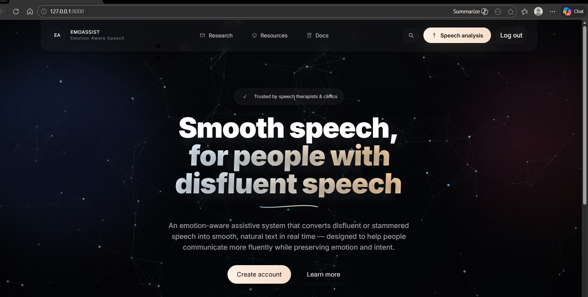
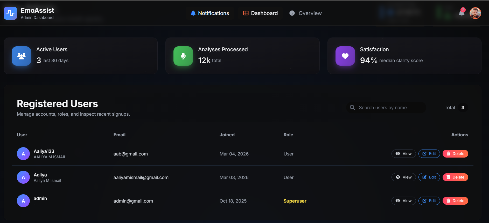
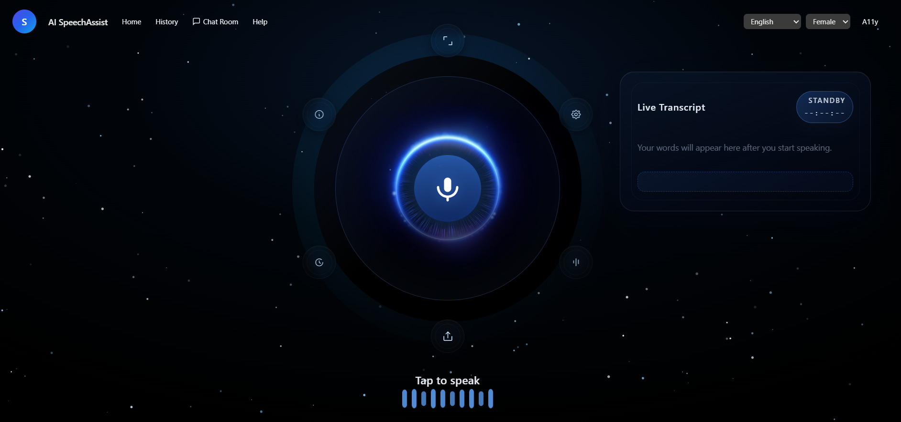
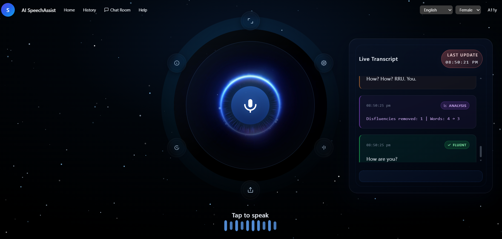

# Real-Time Stuttered Speech-to-Text Conversion Using Machine Learning

An AI-powered speech processing system designed to convert **stuttered or disfluent speech into fluent, readable text in real time**. The project combines speech processing, machine learning, automatic speech recognition, and natural language processing to improve the accessibility of speech-to-text systems for people with speech disfluencies.

## 📌 Project Overview

People who stutter may experience repetitions, prolongations, blocks, and other speech disfluencies that can affect the performance of conventional speech recognition systems.

This project aims to develop a real-time pipeline that processes speech, identifies speech disfluencies, generates text, and applies NLP-based correction to produce more fluent and readable output.

## 🎯 Objectives

* Convert stuttered speech into text in real time.
* Identify speech disfluencies during the transcription process.
* Improve the readability of transcribed text.
* Apply machine learning and NLP techniques for speech processing.
* Develop a user-friendly interface for real-time speech transcription.
* Explore AI-based assistive technology for individuals with speech disfluencies.

## 🏗️ System Workflow

```text
Input Speech
     ↓
Audio Preprocessing
     ↓
Speech Feature Extraction
     ↓
Speech Recognition
     ↓
Disfluency Detection
     ↓
NLP-Based Text Correction
     ↓
Fluent Text Output
```

## 🧠 Methodology

### 1. Audio Input

The system accepts speech through a microphone and processes the incoming audio for real-time transcription.

### 2. Audio Preprocessing

The speech signal is prepared for further processing through appropriate preprocessing and normalization techniques.

### 3. Speech Feature Extraction

**Wav2Vec2** is used to obtain meaningful representations from the speech signal and capture relevant acoustic information.

### 4. Disfluency Detection

A machine learning model based on **Multi-Layer Perceptron (MLP)** is used to identify speech disfluencies from the extracted speech representations.

### 5. Speech-to-Text Conversion

The processed speech is converted into textual form using speech recognition techniques.

### 6. NLP-Based Correction

**BERT** is used for contextual language understanding and text refinement to improve the fluency and readability of the generated transcription.

### 7. Final Output

The system presents the processed and corrected text through a web-based interface.

## 🛠️ Technologies Used

* **Programming Language:** Python
* **Machine Learning:** Multi-Layer Perceptron (MLP)
* **Speech Processing:** Wav2Vec2
* **Natural Language Processing:** BERT
* **Libraries/Frameworks:** TensorFlow, Scikit-learn
* **Data Processing:** Pandas, NumPy
* **Development:** Jupyter Notebook, VS Code
* **Version Control:** Git, GitHub

## 📊 Datasets

The project uses publicly available speech datasets for developing and evaluating the speech disfluency detection system.

### SEP-28K

SEP-28K is a large-scale dataset containing speech segments from people who stutter and includes different categories of speech disfluencies.

### BOLI Dataset

The BOLI dataset provides additional speech data relevant to stuttering and speech disfluency research.

## 🖥️ Application Screenshots

### Home Interface


### Admin Dashboard


### Speech Input


### Transcription


> Replace the image filenames above with your actual screenshot filenames if they are different.


## 📈 Results

The proposed system was evaluated on the BOLI and SEP-28K datasets using
F1-score and Word Error Rate (WER).

- **Disfluency Detection F1-Score:** 86%
- **WER Before Fluency Correction:** 32.5%
- **WER After NLP-Based Correction:** 14.2%
- **WER Reduction:** Approximately 56%
- **ROC-AUC:** 1.00

The complete system, combining MLP, BERT, and NLP-based correction, achieved
an F1-score of 0.86. The NLP-based fluency correction reduced the Word Error
Rate from 32.5% to 14.2%, demonstrating improved fluency and readability
while preserving the intended meaning.

## 🚀 Key Features

* Real-time speech input
* Speech preprocessing
* Speech feature extraction using Wav2Vec2
* Machine-learning-based disfluency detection
* Speech-to-text conversion
* Context-aware text correction using BERT
* Fluent text generation
* Web-based user interface

## ⚙️ Installation

Clone the repository:

```bash
git clone https://github.com/YOUR-USERNAME/Real-Time-Stuttered-Speech-to-Text.git
```

Navigate to the project directory:

```bash
cd Real-Time-Stuttered-Speech-to-Text
```

Create a virtual environment:

```bash
python -m venv venv
```

Activate the environment on Windows:

```bash
venv\Scripts\activate
```

Install the required dependencies:

```bash
pip install -r requirements.txt
```

## ▶️ Running the Project

Run the application using the appropriate entry-point file:

```bash
python app.py
```

> Replace `app.py` with the actual entry-point file used in your project.

## 📁 Project Structure

```text
Real-Time-Stuttered-Speech-to-Text/
│
├── screenshots/
│   ├── home.png
│   ├── admin-dashboard.png
│   ├── speech-input.png
│   ├── transcription.png
│
├── data/
├── models/
├── notebooks/
├── src/
├── app.py
├── requirements.txt
└── README.md
```

Adjust the structure above according to the actual files in your repository.

## 🔮 Future Scope

* Improve real-time transcription latency.
* Support additional Indian languages.
* Improve recognition of different types of speech disfluencies.
* Expand the training dataset with diverse speakers.
* Improve contextual correction of disfluent speech.
* Explore lightweight models for deployment on resource-constrained devices.
* Develop a more accessible interface for users with speech impairments.

## 📚 Research Publication

**Real-Time Stuttered Speech-to-Text Conversion Using Machine Learning**
Presented at the **International Conference on Trends in Engineering, Science and Technology (ICTEST 2026)**.

## 👩‍💻 Author

**Aaliya M. Ismail**

B.Tech Computer Science and Engineering – Artificial Intelligence

---

⭐ If you find this project useful, consider giving the repository a star.
